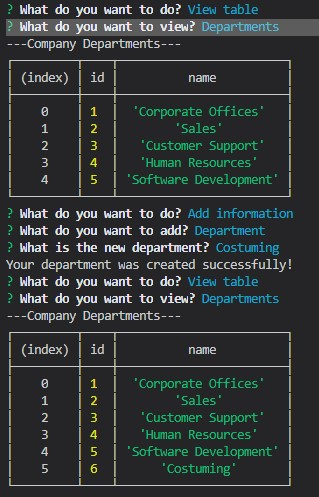
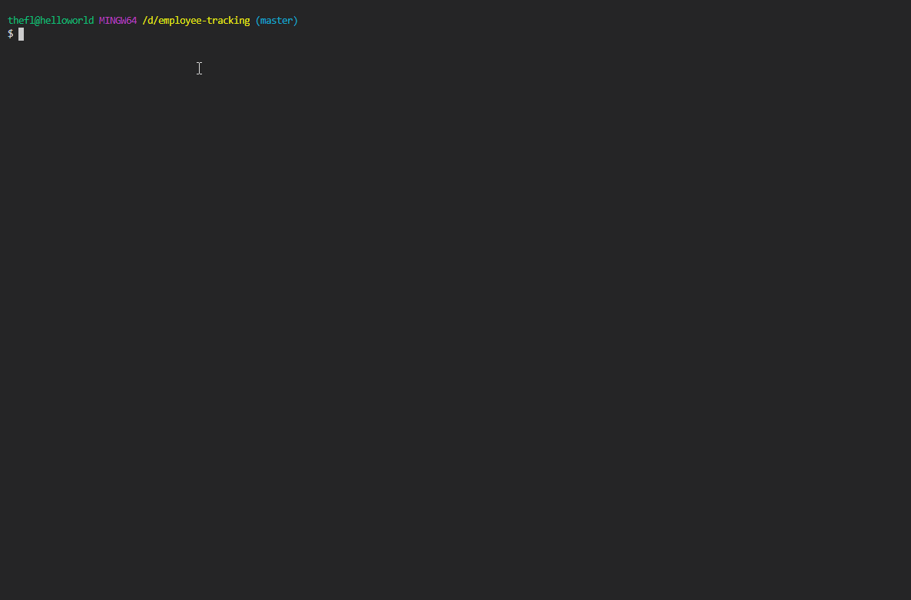

# Company Database

## What it is

This is a local node application that will take user input to update a company database with employee, role, and department information.

## Where it is

The application files can be downloaded to your local machine using:

git clone <https://github.com/JulieT2319/employee-tracking.git>

## How to use it

Copy the default.env file to .env. Update the provided variables to your environments values.

Using the schema.sql file, create the mysql database.

A seed.sql file is also provided for initial set up and testing.

Using your cli, cd into the application folder.

npm i

After the required packages have installed, run the program using the command:

node app.js

Answer the prompts provided to view and update the company database

